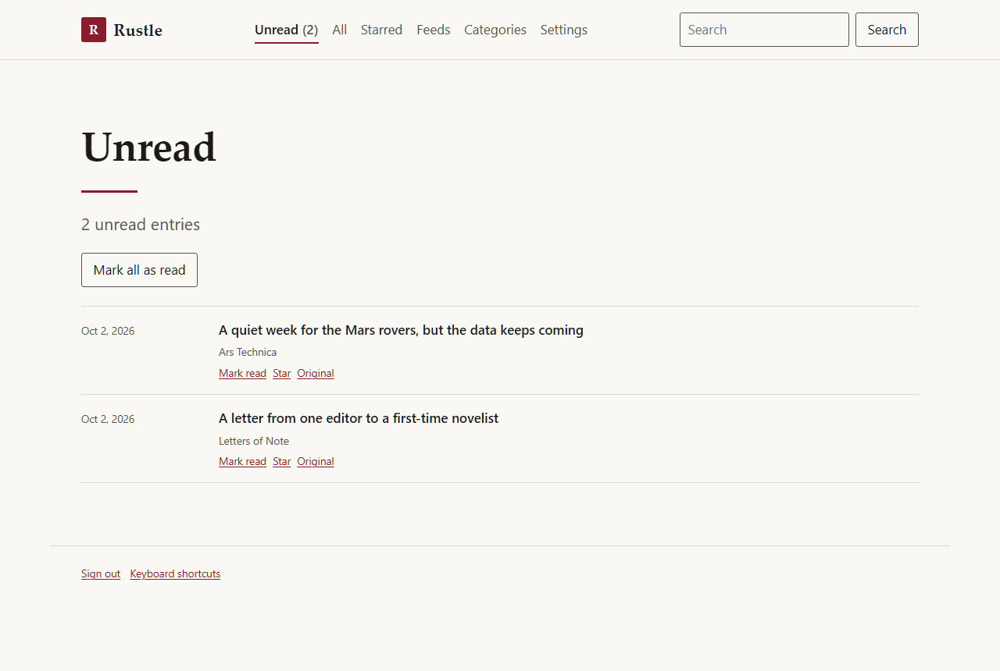
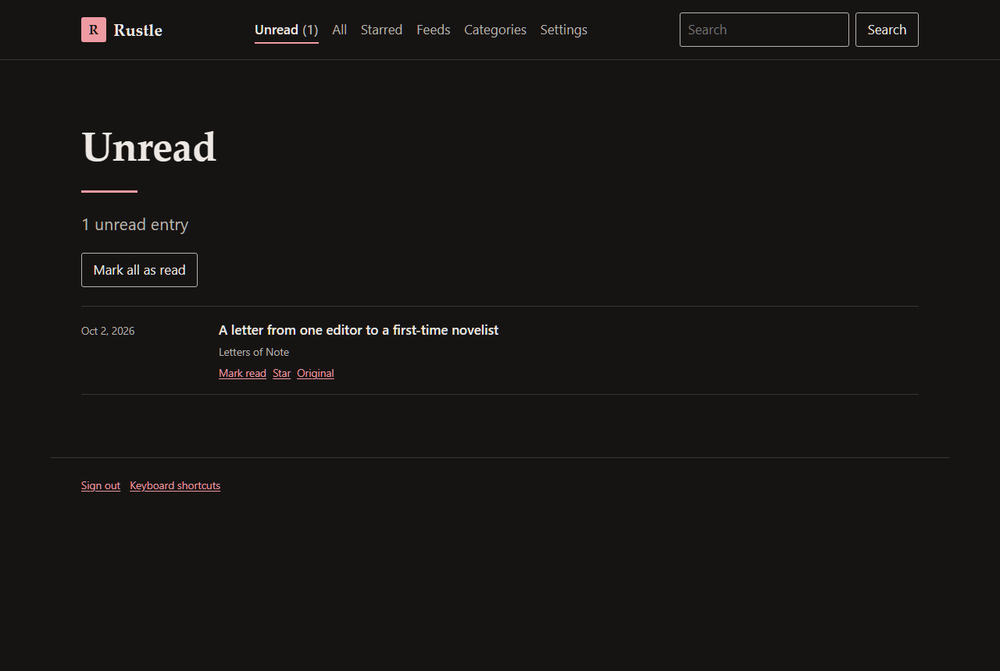
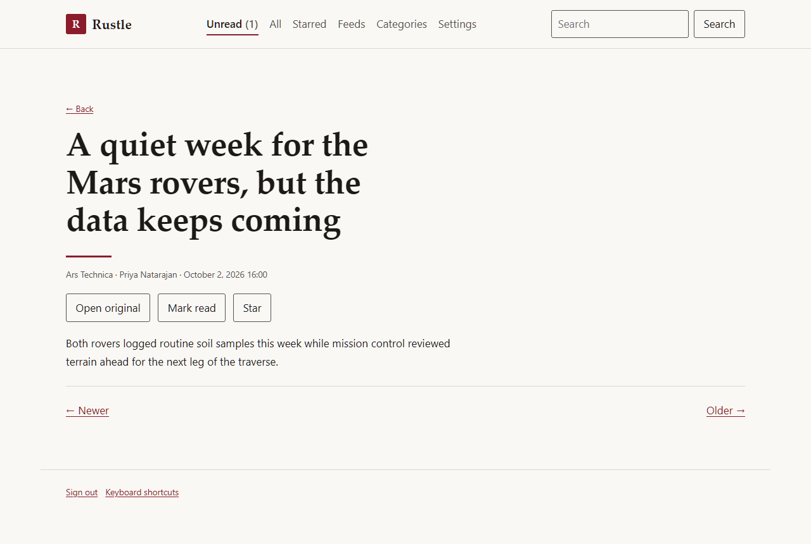
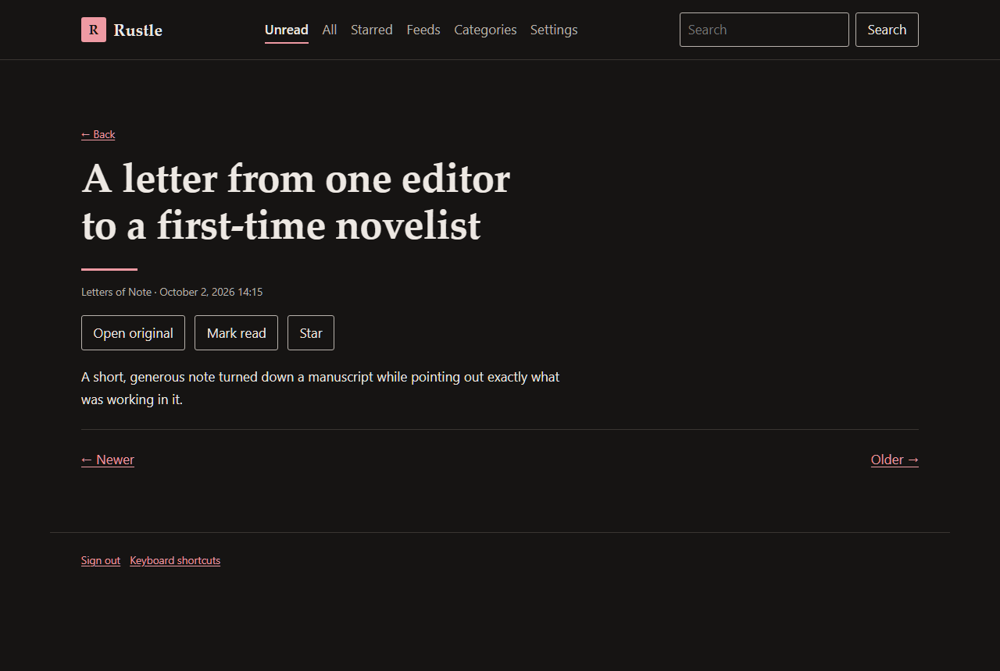

# Rustle

A minimalist, single-user, self-hosted RSS and Atom reader. Server-rendered, keyboard-first,
no JavaScript framework — one small hand-written script for shortcuts and the theme toggle,
and every feature still works with it switched off.

Inspired by [Miniflux](https://github.com/miniflux/v2)'s philosophy; no Miniflux code is used.

<p>
  
  
</p>
<p>
  
  
</p>

## Features

- Subscribe by feed or site URL, with autodiscovery; OPML import and export.
- Categories, with a browsable view per category and per feed.
- Unread, All, and Starred views, keyset-paginated, newest first.
- A clean reading view with sanitized content and previous/next navigation.
- Full-text search over titles and content, ranked by relevance.
- Light and dark themes, following the OS by default, with a manual toggle that works
  without JavaScript.
- Keyboard shortcuts for everything (`?` for the full list), built as progressive
  enhancement over forms and links that already work on their own.
- Configurable retention for read, unstarred entries; starred entries are kept forever.
- A single static binary plus PostgreSQL. No separate background worker, no Redis, no
  object storage.

## Deploying

See [`deploy/README.md`](deploy/README.md) — a Docker Compose quickstart in 5 commands, or
a bare-metal systemd + Caddy + PostgreSQL walkthrough.

## Running locally

Needs a Rust toolchain and Docker (for PostgreSQL only — Rustle itself runs on the host).

```sh
docker compose -f docker-compose.dev.yml up -d   # PostgreSQL for local dev and tests
cp .env.example .env
cargo run
```

Then open <http://localhost:8080/setup>. Rustle prints a one-time setup token to the
terminal on first start — paste it in along with a username and password to create your
account. Migrations run automatically, so there's no separate database setup step.

`cargo test` runs the full suite (unit tests plus `#[sqlx::test]`s against the same
PostgreSQL container).

## Developing

See [`PLAN.md`](PLAN.md) for the architecture, schema, route map, and the implementation
log — what was built in each phase, what was found along the way, and the measured
performance and page-weight budgets.

## License

MIT
